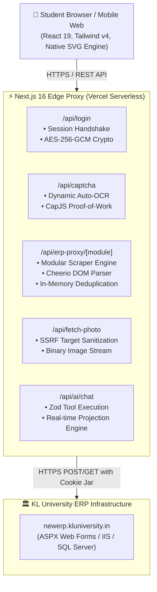

# 🏛️ KL Sync - Architecture & System Design

## 1. System Overview & Core Requirements
**KL Sync** is an ultra-fast, stateless, dark-themed modern web client and edge proxy for KL University's legacy ERP system (`newerp.kluniversity.in`). It intercepts legacy ASP.NET/HTML responses, transforms them into structured JSON payloads with Cheerio, and renders them in a high-density, responsive Next.js 16 (App Router + Turbopack) dashboard.

---

## 2. High-Level Architecture



---

## 3. Data Strategy: Storage, Caching, and Security

### 3.1 Stateless Storage Model
- **Zero Database Persistence**: Student credentials, passwords, and sensitive academic records are never stored on persistent disks or databases.
- **Client-Side Session Token**: Upstream ASP.NET session cookies and CSRF tokens are bundled and encrypted using **AES-256-GCM** via the Web Crypto API, derived from the server's `SESSION_SECRET`.
- **Integrity Guarantee**: The encrypted payload is prefixed with `enc.`, base64-encoded, and protected by authentication tags that prevent client-side tampering.

### 3.2 Caching & Concurrency Discipline
1. **Client-Side Request Deduplication (`useNativeQuery`)**:
   - In-flight HTTP requests for identical tuples (`[url, year, semester]`) are coalesced using a global `inFlightDedupeMap`, preventing duplicate network traffic.
   - Dynamic key switching uses `useRef` stabilization to prevent cascading re-render or infinite fetch loops.
2. **Edge Photo Caching**:
   - Student ID card photos proxied via `/api/fetch-photo` return immutable cache headers (`Cache-Control: public, max-age=86400, immutable`), offloading repeat requests to browser and CDN edge caches.
3. **Zero-Loading Data Prefetcher (`data-prefetcher.ts`)**:
   - Immediately after login, `prefetchAllUserData()` fires parallel fetches for all 9 ERP modules (Attendance, Timetable, Marks, Fee, Profile, Circulars, Hostels, Library, Exam Seating).
   - Results are stored in a global in-memory cache with `sessionStorage` persistence, enabling synchronous initial state retrieval and SWR background revalidation.
   - Dashboard tabs render instantly with zero loading screens.

---

## 4. API Specification & Endpoints

| Endpoint | Method | Purpose | Input Payload | Output Format |
| :--- | :---: | :--- | :--- | :--- |
| `/api/captcha` | `GET` | Retrieves captcha challenge image & session cookies | None | `{ captchaImage, solvedCaptcha, sessionId }` |
| `/api/captcha/challenge` | `POST` | Generates proof-of-work puzzle for captcha verification | `{ token }` | `{ challenge, token }` |
| `/api/captcha/redeem` | `POST` | Validates solved proof-of-work and returns challenge token | `{ solution }` | `{ success, token }` |
| `/api/login` | `POST` | Authenticates student credentials with ERP server | `{ username, password, captcha, sessionId }` | `{ success, message, sessionId, data }` |
| `/api/erp-proxy/[module]` | `GET / POST` | Proxies and parses ERP data (attendance, marks, etc.) | `{ academicYear, semesterId, ... }` | `{ success, data }` |
| `/api/fetch-photo` | `GET` | Proxies student avatar photos with SSRF protection | `?id=STUDENT_ID` or `?path=/uploads/...` | Image stream (`image/jpeg`, `image/png`) |
| `/api/ai/chat` | `POST` | Context-aware AI Copilot with tool-calling execution | `{ messages, userContext }` | Streaming text / tool response |

---

## 5. Modular Scraper Engine (`src/lib/scrapers/`)

```
src/lib/
├── scraper.ts              # Facade re-exporting modular scrapers
└── scrapers/
    ├── http-jar.ts         # Cookie jar serialization, fetch with timeouts, generic table parsers
    ├── attendance.ts       # Captcha resolution, login validation, and attendance breakdown
    ├── timetable.ts        # Timetable matrix grid parser and period slot normalizer
    ├── marks.ts            # Internal evaluation, end exam marks, and dual-bound semester mapping
    ├── fee.ts              # Fee receipt tracking and payment breakdown
    └── profile.ts          # Multi-tab demographic profile scraper
```

---

## 6. Resilience & Failure Modes

1. **ERP Unavailability / Server Downtime**:
   - Wrapped with `AbortSignal.timeout(25000)` to ensure Next.js serverless functions terminate cleanly without hanging worker threads.
   - Client-side optimistic UI retains cached state while displaying non-blocking notifications.
2. **ERP Markup & Schema Drift**:
   - Dual-binding parameter strategy (`DynamicModel[semester]` and `DynamicModel[semesterid]`).
   - Flexible Cheerio column index resolution to handle shifted table headers.
3. **High Request Concurrency**:
   - In-memory rate limiting (`src/lib/request-utils.ts`) prevents client IP flood attacks on university servers.

---

## 7. International Compliance & Localization

### 7.1 Regulatory Compliance Framework
KL Sync implements client-side compliance controls aligned with 8 international privacy regulations and 5 accessibility standards:
- **Privacy**: GDPR, CCPA/CPRA, HIPAA, PIPEDA/CPPA, LGPD, DPDPA, PIPL, 152-FZ.
- **Accessibility**: WCAG 2.2 AAA, EAA/EN 301 549, Section 508, i18n, RTL.

Key modules:
- `src/lib/compliance/compliance-data.ts`: 13 regulatory badge metadata definitions.
- `src/lib/compliance/compliance-manager.ts`: Data Export (GDPR Art. 20), Cryptographic Erasure (Art. 17), Consent Manager.
- `src/components/compliance/ComplianceModal.tsx`: Interactive Compliance Center with live badge bar.

### 7.2 Internationalization (i18n) & RTL
- `src/lib/i18n/index.ts`: Zero-dependency 9-language translation engine (en, te, hi, es, fr, de, ar, zh, ru).
- `src/components/ui/LanguageSelector.tsx`: Language picker with Globe icon and `localStorage` persistence.
- Arabic (`ar`) triggers `dir="rtl"` on `<html>`, activating CSS logical property mirroring in `globals.css`.
