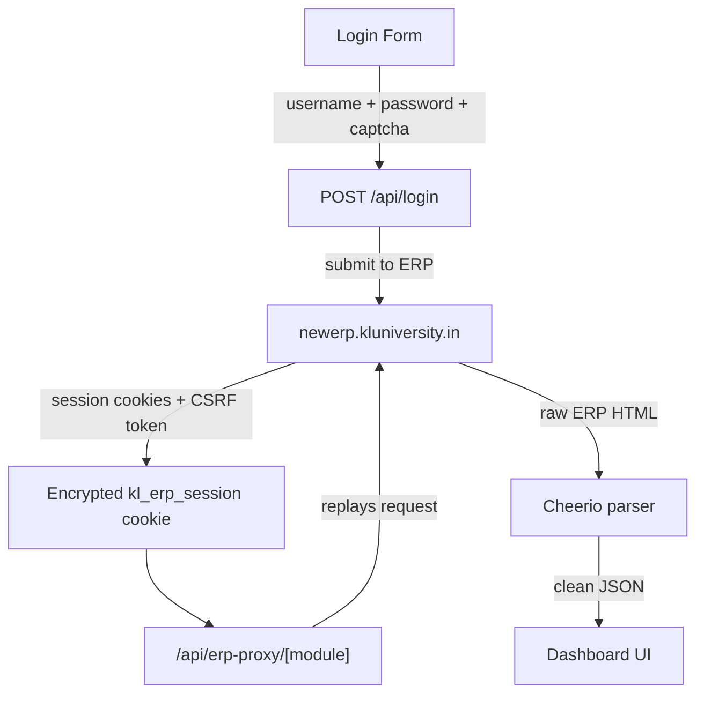

<div align="center">
  
  <h1>KL Sync</h1>
  <p><strong>An unofficial, minimalist ERP client for KL University.</strong></p>

  <p>
    <a href="https://nextjs.org/"></a>
    <a href="https://react.dev/"></a>
    <a href="https://www.typescriptlang.org/"></a>
    <a href="https://tailwindcss.com/"></a>
  </p>
</div>

---

## ✨ Overview

KL University's ERP handles attendance, marks, fees, and student records, but the interface isn't optimized for modern mobile devices. **KL Sync** sits in front of it. Log in with your normal ERP credentials, and it turns your data into a fast, beautiful, dark-themed dashboard.

> **Note**: This is an independent project built by a student, and is **not** endorsed by KL University. See the [Disclaimer](#-disclaimer).

## 🚀 Features

### 📊 Dashboard
Everything you need, available at a glance:
- **Attendance**: Detailed per-subject breakdown.
- **Academics**: Internal marks, end-semester results, and CGPA.
- **Logistics**: Timetable, fee orders, exam seating, circulars, hostel info, and library circulation history.
- **Profile**: Complete student profile including your ID photo.

### 🛠️ Tools
- **Attendance Calculator**: Find out exactly how many classes you can afford to miss, or how many you need to attend to hit the 75% or 85% thresholds.
- **CGPA Goal Predictor**: Calculate the exact GPA you need this semester to reach your target CGPA.
- **OCR Scan Tool**: A standalone scan-to-text tool running entirely in your browser.

## ⚙️ How it Works



1. You manually submit your ERP credentials and the required captcha on the login page.
2. Upon successful login, the ERP's session cookies and CSRF token are packed into a single `kl_erp_session` cookie. If `SESSION_SECRET` is set, this is encrypted with **AES-256-GCM**.
3. All subsequent dashboard requests flow through `/api/erp-proxy/[module]`. It decrypts the session, replays the request against the real ERP, and parses the returned HTML into clean JSON using Cheerio.

## 💻 Getting Started

Requires **Node.js 20+**.

```bash
git clone https://github.com/tejaswin-amara/kl-sync.git
cd kl-sync
npm install
npm run dev
```

Open [http://localhost:3000](http://localhost:3000) in your browser.

### Environment Variables

While not strictly required for local development, you should configure these for any deployment. Create a `.env.local` in the project root:

```bash
SESSION_SECRET=your_super_long_random_string_here
```

| Variable | Description |
|---|---|
| `SESSION_SECRET` | Encrypts the session cookie with AES-256-GCM. **Always** set this for public deployments to keep sessions secure. |

## 🏗️ Project Structure

```text
src/
├── app/
│   ├── api/
│   │   ├── login/                # ERP authentication
│   │   ├── captcha/              # Fetch captcha image
│   │   ├── erp-proxy/[module]/   # Route for attendance, marks, fees, etc.
│   │   └── fetch-photo/          # Student ID photo retrieval
│   ├── dashboard/                # UI routes for features
│   └── page.tsx                  # Login screen
├── components/                   # Reusable UI components & layouts
├── lib/
│   ├── scraper.ts                # Cheerio HTML parsing logic
│   └── session.ts                # Session encode/decode logic
└── middleware.ts                 # Guards /dashboard routes
```

## ⚖️ Disclaimer

KL Sync is an independent project built by a student, for KLU students. It has no affiliation with, endorsement from, or support from KL University.

Your ERP username and password are used exactly **once** to authenticate against the real ERP, and are **never** written to disk. The app only retains the resulting session, which is encrypted if `SESSION_SECRET` is configured. If you are using an instance deployed by someone else, your session passes through their server. For maximum privacy, self-hosting is highly recommended.

## 🤝 Community

- **[Contributing](CONTRIBUTING.md)**: PRs and issues are welcome! Please read the guidelines first.
- **[Code of Conduct](CODE_OF_CONDUCT.md)**: We maintain a welcoming, respectful community.
- **[Security](SECURITY.md)**: Guidelines on how to responsibly report vulnerabilities.
- **[License](LICENSE)**: This project is strictly copyrighted. See the license file for detailed terms.

---

<p align="center">
  Built with ❤️ by <a href="https://github.com/tejaswin-amara">Tejaswin</a> for KLU students.
</p>
