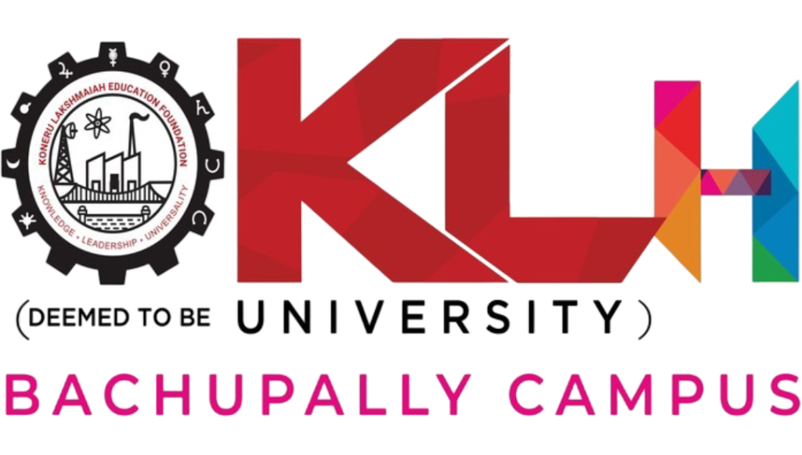
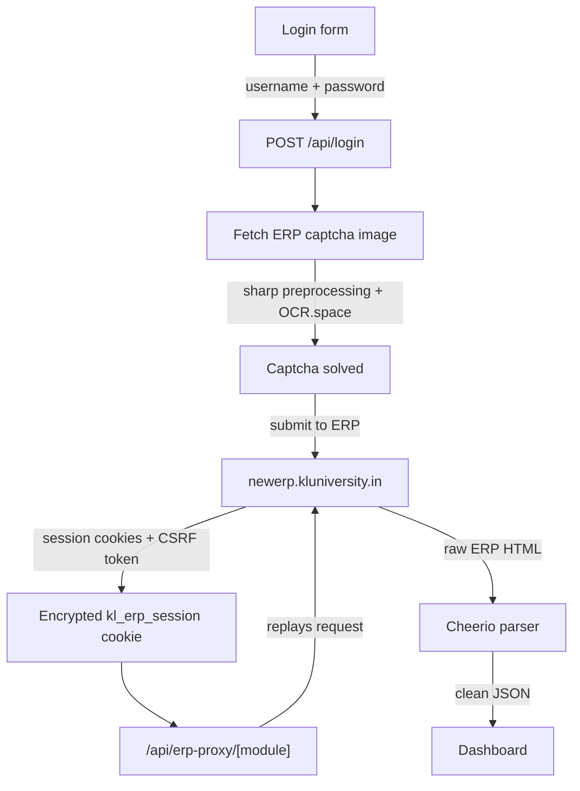

<p align="center">
  
</p>

<h1 align="center">KL Sync</h1>
<p align="center">An unofficial ERP client for KL University.</p>

<p align="center">
  
  
  
  
  
</p>

---

## What it is

KL University's ERP handles attendance, marks, fees, and the rest of student records, but logging in means solving a captcha by hand every time, and the interface wasn't built for a phone.

KL Sync sits in front of it. Log in once with your normal ERP credentials, and it solves the captcha for you, holds onto your session, and turns the same data into a fast, installable, dark-themed dashboard.

It's an independent project built by a student, not something run or endorsed by KL University — see [Disclaimer](#disclaimer).

## Features

**Dashboard**

Attendance (per-subject breakdown), internal marks, end-semester results, CGPA, timetable, fee orders, exam seating allotment, circulars, hostel info, library circulation history, and profile with your ID photo.

**Tools**

- An attendance calculator: how many classes you can miss and still hold 75%, or how many you need to attend to reach 75% or 85%.
- A CGPA goal predictor: the GPA you'd need this semester to hit a target CGPA.
- A standalone scan-to-text tool that runs OCR on any uploaded image, entirely in the browser.

**Login and session**

- The login captcha is solved automatically — nothing to type by hand.
- Your session is held in a single cookie so you're not logging in on every visit.
- Installable as a PWA: add it to your home screen and it opens full-screen, like a native app.

## How it works



1. You submit your ERP username and password on the login page.
2. The app fetches the live captcha image from the ERP and solves it via the OCR.space API. KLU's captcha is solid-colour glyphs on a transparent background, so the image is preprocessed with `sharp` to isolate the alpha channel before OCR — that step is most of what makes the auto-solve reliable.
3. On a successful login, the ERP's session cookies and CSRF token are packed into one `kl_erp_session` cookie. If `SESSION_SECRET` is set, that cookie is encrypted with AES-256-GCM; otherwise it falls back to base64, which is fine for local development but not for a public deployment.
4. `middleware.ts` checks for that cookie on every `/dashboard/*` request and redirects to the login page if it's missing.
5. Every dashboard page reads from one route, `/api/erp-proxy/[module]`. It decrypts the session, replays the request against the real ERP, and parses the HTML that comes back with Cheerio into JSON.

## Getting started

Requires Node.js 20+.

```bash
git clone https://github.com/tejaswin-amara/kl-sync.git
cd kl-sync
npm install
npm run dev
```

Open [http://localhost:3000](http://localhost:3000).

### Environment variables

Neither is required to run the app locally, but both matter for anything beyond your own machine. Create a `.env.local` in the project root:

```bash
SESSION_SECRET=some-long-random-string
OCR_SPACE_API_KEY=your-ocr-space-key
```

| Variable | Purpose |
|---|---|
| `SESSION_SECRET` | Encrypts the session cookie with AES-256-GCM instead of plain base64. Set this for any deployment beyond your own machine. |
| `OCR_SPACE_API_KEY` | A free key from [ocr.space/ocrapi](https://ocr.space/ocrapi). Without it, the app falls back to shared public demo keys, which run out of quota often and make captcha auto-fill fail silently. |

## Tech stack

| | |
|---|---|
| Framework | Next.js 16 (App Router, Turbopack) |
| UI | React 19, Tailwind CSS v4, Framer Motion |
| Language | TypeScript |
| ERP scraping | Cheerio |
| OCR | OCR.space API for the login captcha, Tesseract.js for the in-app scan tool |
| PWA | next-pwa |
| Icons | Lucide |

## Project structure

```
src/
├── app/
│   ├── api/
│   │   ├── login/                # ERP login
│   │   ├── captcha/               # fetch the captcha image
│   │   ├── solve-captcha/         # OCR the captcha
│   │   ├── erp-proxy/[module]/    # attendance, marks, fee, timetable, and the rest
│   │   └── fetch-photo/           # student ID photo
│   ├── dashboard/                 # attendance, marks, fee, timetable, hostels, library...
│   └── page.tsx                   # login screen
├── components/                    # navigation, glass-card, OCR tool, calculators
├── lib/
│   ├── scraper.ts                 # ERP HTML parsing (Cheerio)
│   ├── ocr.ts                     # captcha preprocessing + OCR.space
│   └── session.ts                 # session encode/decode
└── middleware.ts                  # guards /dashboard routes
```

## Disclaimer

KL Sync is an independent project built by a student, for KLU students. It has no affiliation with, endorsement from, or support from KL University.

Your ERP username and password are used once, to authenticate against the real ERP, and are never written to disk. After that, the app keeps only the resulting session — encrypted if `SESSION_SECRET` is set. If you're using an instance someone else deployed rather than running your own, your session still passes through their server, so self-hosting is the safer option if that matters to you.

## Contributing

Issues and pull requests are welcome. [Open one here](https://github.com/tejaswin-amara/kl-sync/issues).

## License

No license file is included, so the default is full copyright with all rights reserved. Ask before reusing the code.

---

<p align="center">Built by <a href="https://github.com/tejaswin-amara">Tejaswin</a> for KLU students stuck retyping captchas.</p>
