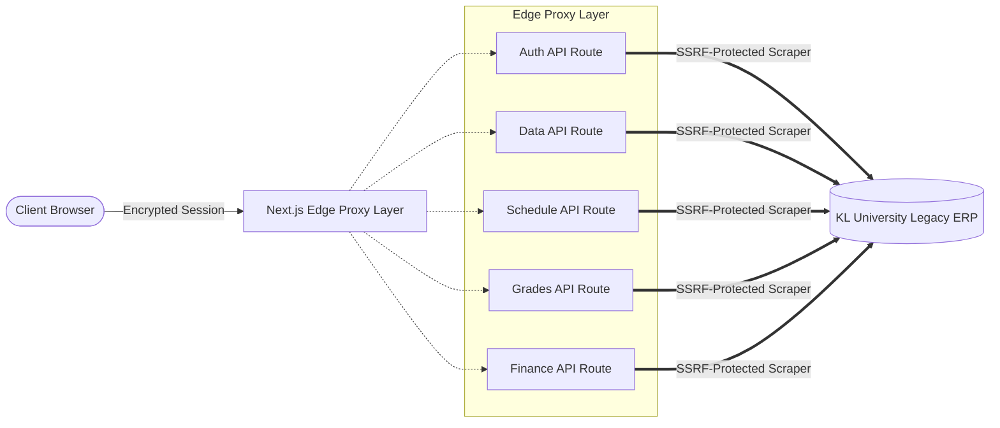

<div align="center">
  <h1>KL Sync</h1>
  <p><strong>The Enterprise-Grade KL University ERP Client</strong></p>

  <p>
    
    
    
    
  </p>
  <p>
    
    
    
  </p>
</div>

## Overview

Welcome to **KL Sync**, the premier source-available **KL University ERP client** designed for performance, security, and unparalleled user experience. This modern **student portal** leverages a stateless **edge proxy** architecture to communicate seamlessly with the legacy ERP infrastructure. As a highly optimized **Next.js dashboard**, KL Sync offers a suite of essential tools including a real-time **attendance tracker**, an accurate **CGPA calculator**, and secure academic data access—all delivered at edge speeds with uncompromising reliability.

## Architecture

KL Sync operates entirely at the edge, utilizing a zero-database, stateless proxy layer that securely orchestrates requests to the legacy KL University ERP.


```mermaid
flowchart LR
    Client([Client Browser]) -->|Encrypted Session| Edge[Next.js Edge Proxy Layer]

    subgraph Edge Proxy Layer
        Auth[Auth API Route]
        Data[Data API Route]
        Schedule[Schedule API Route]
        Grades[Grades API Route]
        Finance[Finance API Route]
    end

    Edge -.-> Auth
    Edge -.-> Data
    Edge -.-> Schedule
    Edge -.-> Grades
    Edge -.-> Finance

    Auth & Data & Schedule & Grades & Finance ==>|SSRF-Protected Scraper| ERP[(KL University Legacy ERP)]
```

## Quickstart

Get up and running locally in minutes:

1. **Clone the repository**

   ```bash
   git clone https://github.com/tejaswin-amara/kl-sync.git
   cd kl-sync
   ```

2. **Install dependencies**

   ```bash
   npm install
   ```

3. **Configure environment variables**

   ```bash
   cp .env.example .env.local
   # Update .env.local with your SESSION_SECRET
   ```

4. **Start the development server**

   ```bash
   npm run dev
   ```

5. **Access the application**
   Open [http://localhost:3000](http://localhost:3000) in your browser.

## Dashboard Module Suite

KL Sync features 11 comprehensive modules tailored for the modern student experience:

| Module           | Route                   | Icon Primitive  | Key Features                                |
| ---------------- | ----------------------- | --------------- | ------------------------------------------- |
| **Overview**     | `/dashboard`            | `home-icon`     | At-a-glance academic summary, alerts        |
| **Attendance**   | `/dashboard/attendance` | `clock-icon`    | Real-time tracking, low-attendance warnings |
| **Timetable**    | `/dashboard/timetable`  | `calendar-icon` | Weekly schedule, classroom locations        |
| **Marks**        | `/dashboard/marks`      | `chart-icon`    | Grades breakdown, CGPA calculator           |
| **Profile**      | `/dashboard/profile`    | `user-icon`     | Personal details, biometric info            |
| **Fee**          | `/dashboard/fee`        | `wallet-icon`   | Payment history, pending dues, receipts     |
| **Tools**        | `/dashboard/tools`      | `wrench-icon`   | AI Copilot, utility calculators             |
| **Circulars**    | `/dashboard/circulars`  | `bell-icon`     | Official announcements, notifications       |
| **Hostels**      | `/dashboard/hostels`    | `building-icon` | Room allocation, mess menus                 |
| **Library**      | `/dashboard/library`    | `book-icon`     | Issued books, due dates, catalog            |
| **Exam Seating** | `/dashboard/seating`    | `seat-icon`     | Room numbers, seating charts                |

## Security Architecture

Security is built-in by design, utilizing the "Ponytail Philosophy" (zero bloat, relying on standard library primitives):

- **AES-256-GCM Encryption**: All session tokens are encrypted using the native Web Crypto API. No session data is stored on our servers.
- **SSRF Protection**: Strict URL parsing and whitelisting at the proxy layer prevent Server-Side Request Forgery.
- **Stateless Design**: Zero database architecture means no persistent PII storage, inherently minimizing breach vectors.
- **Bot Protection**: CapJS Proof-of-Work prevents automated brute-force attacks on the proxy endpoints.

## Environment Variables

| Variable              | Description                                      | Requirement                |
| --------------------- | ------------------------------------------------ | -------------------------- |
| `SESSION_SECRET`      | 32-byte base64 string for AES-256-GCM encryption | **Required** in Production |
| `NEXT_PUBLIC_API_URL` | Base URL for edge proxy routes                   | Optional                   |
| `OPENAI_API_KEY`      | Key for the AI Copilot features                  | Optional                   |

## Quality Gates

Our CI/CD pipeline enforces rigorous standards before any code reaches production:

- **Typecheck**: Strict TypeScript 5.8 validation (`tsc --noEmit`).
- **Lint**: ESLint + Next.js core web vitals strict mode.
- **Unit Tests**: 320 tests across 54 suites using the native `node:test` runner.
- **E2E Tests**: 13 Playwright flows testing real browser interactions.
- **Agent-as-Judge**: 9 AI-powered suites verifying Copilot responses and complex semantic behaviors.
- **Build**: Turbopack production compilation.

## Tech Stack Defaults vs Alternatives matrix

Guided by the "Ponytail Philosophy", we prioritize zero-dependency standard libraries over bloated packages.

| Category           | KL Sync Choice                 | Alternative              | Rationale                                                         |
| ------------------ | ------------------------------ | ------------------------ | ----------------------------------------------------------------- |
| **Framework**      | Next.js 16 (App Router)        | Remix / SvelteKit        | Superior edge-runtime support and Turbopack ecosystem.            |
| **State**          | Native hooks + sessionStorage  | SWR / TanStack Query     | YAGNI; standard React hooks are sufficient for a stateless proxy. |
| **Styling**        | Tailwind CSS v4 + Vanilla CSS  | CSS Modules / Styled     | Unmatched utility-first speed without runtime overhead.           |
| **Icons**          | Native zero-runtime SVG engine | lucide-react / heroicons | 57 hand-crafted primitives yield zero bundle size bloat.          |
| **Validation**     | Zod                            | Yup / io-ts              | TypeScript-first schema validation required for AI tool calling.  |
| **Testing**        | native `node:test`             | Jest / Vitest            | No external dependencies, blazingly fast execution.               |
| **Scraping**       | Cheerio                        | Puppeteer / jsdom        | Lightweight HTML parsing without headless browser overhead.       |
| **AI**             | Vercel AI SDK                  | LangChain                | First-class Next.js integration for Edge streaming.               |
| **Crypto**         | Web Crypto API                 | crypto-js                | Native performance and security without NPM vulnerabilities.      |
| **Bot Protection** | CapJS (PoW)                    | reCAPTCHA / Turnstile    | Privacy-friendly, zero-friction proof-of-work.                    |

## Documentation Links

- [Development Guide](./docs/development.md)
- [Architecture Blueprint](./docs/architecture.md)
- [Security Model](./docs/security.md)

## License & Disclaimer

**Proprietary License**  
Copyright © 2026 Tejaswin Amara. All rights reserved.  
This software is source-available but **not open source** (NOT MIT). You may view the source code, but you may not copy, distribute, modify, or use it for commercial purposes without explicit written permission from the author.

This project is an independent client and is **not affiliated with, endorsed by, or connected to KL University**.

---

<div align="center">
  Crafted with ❤️ by Tejaswin
</div>
