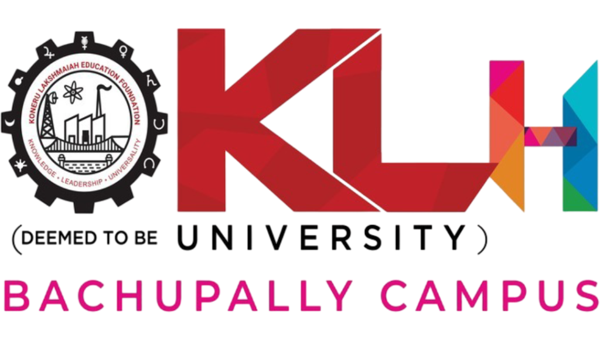

<div align="center">

  
  <h1>KL Sync</h1>
  <p><strong>An exhaustive, unofficial, minimalist ERP client for KL University.</strong></p>

  <p>
    <a href="https://klhb.vercel.app"></a>
    <a href="https://nextjs.org/"></a>
    <a href="https://react.dev/"></a>
    <a href="https://www.typescriptlang.org/"></a>
    <a href="https://tailwindcss.com/"></a>
    <a href="DESIGN.md"></a>
  </p>
</div>

---

## 🌐 Live Production Deployment

Access the live production instance deployed on Vercel:
👉 **[https://klhb.vercel.app](https://klhb.vercel.app)**

---

## ✨ Project Overview

KL University's official ERP system serves as the central hub for student data, handling attendance, marks, fees, and logistics. However, the interface is historically legacy-based and lacks modern mobile responsiveness. 

**KL Sync** acts as an intermediary layer—a modern frontend that proxies requests to the actual ERP backend. By authenticating with your normal ERP credentials, KL Sync intercepts the standard HTML responses from the ERP, parses the data intelligently via Cheerio, and renders it onto a fast, dark-themed, highly responsive dashboard built natively with Next.js 16 and Tailwind CSS v4.

This architecture ensures you see real-time data securely, without suffering through archaic UI structures or cumbersome page loads. Detailed architectural blueprints can be found in **[ARCHITECTURE.md](ARCHITECTURE.md)**, and the human-crafted dark design system specification is documented in **[DESIGN.md](DESIGN.md)**.

> **Note**: This is an independent open-source project built by students. It is **not** endorsed by or affiliated with KL University. See the [Disclaimer](#-disclaimer).

## 🧰 Dependencies

The project maintains a strict "Ponytail" engineering philosophy: no bloat, standard library and native solutions preferred over heavy dependencies.

**Core Stack:**
- **Next.js (v16.2.9)**: Server-side rendering, API proxy routes, and routing.
- **React (v19.2.4) & React DOM (v19.2.4)**: Component-based UI rendering.
- **TypeScript (v5)**: Static typing and interface definitions for scraped ERP data.
- **Tailwind CSS (v4)**: Utility-first styling via `@tailwindcss/postcss`.

**Utilities:**
- **Cheerio (v1.2.0)**: Used in the backend API routes (`src/lib/scraper.ts`) to parse legacy HTML tables from the ERP and transform them into structured JSON.
- **clsx (v2.1.1) & tailwind-merge (v3.6.0)**: Dynamic utility class merging for highly reusable UI components (`src/lib/utils.ts`).
- **lucide-react (v1.21.0)**: Lightweight SVG iconography across the dashboard.
- **sharp (v0.33.0)**: High-performance image processing for student profile pictures (`src/app/api/fetch-photo/route.ts`).

## ⚙️ Prerequisites

Before you begin, ensure your local development environment meets the following requirements:
- **Node.js**: Version 20.x or higher is strictly required for Next.js 16 and React 19 compatibility.
- **npm**: Version 10.x or higher (comes bundled with Node 20+).
- **Git**: To clone the repository.
- A valid **KL University ERP account** to test data fetching.

## 🚀 Step-by-Step Local Setup

1. **Clone the Repository**
   Open your terminal and clone the repository using Git:
   ```bash
   git clone https://github.com/tejaswin-amara/kl-sync.git
   cd kl-sync
   ```

2. **Install Dependencies**
   Install all required NPM packages:
   ```bash
   npm install
   ```

3. **Configure Environment Variables**
   Copy the example environment file to create your local environment configuration:
   ```bash
   cp .env.example .env.local
   ```
   Open `.env.local` in your editor and provide the necessary secrets (see the [Configuration](#-configuration) section).

4. **Start the Development Server**
   Run the Next.js development server:
   ```bash
   npm run dev
   ```

5. **Access the Application**
   Open [http://localhost:3000](http://localhost:3000) in your browser. You should see the login screen.

## 🔐 Configuration

KL Sync uses environment variables to secure sessions and configure backend behaviors. Configure these in your `.env.local` file.

| Variable | Requirement | Description |
|---|---|---|
| `SESSION_SECRET` | **Required** (Production) | A 32+ character random string. It encrypts the `kl_erp_session` cookie using **AES-256-GCM**. If omitted in production, the app will fall back to base64 encoding (insecure). |
| `NODE_ENV` | Optional | Set to `development` locally or `production` when deployed. Next.js handles this automatically in most cases. |

## 🏗️ Architectural Decision Records & Project Structure

The codebase is split strictly into a decoupled Next.js API layer and a React frontend. The backend acts entirely as a stateless proxy to the ERP.

```text
src/
├── app/
│   ├── api/
│   │   ├── login/                # POST endpoint authenticating against the ERP
│   │   ├── captcha/              # GET endpoint retrieving ERP captcha images
│   │   ├── erp-proxy/[module]/   # Dynamic dynamic proxy route for attendance, marks, etc.
│   │   └── fetch-photo/          # Endpoint optimizing the student ID image via sharp
│   ├── dashboard/                # Protected UI routes for the dashboard
│   │   ├── attendance/           # Detailed subject attendance breakdown
│   │   ├── circulars/            # University circulars
│   │   ├── exam-seating/         # Examination seating plans
│   │   ├── fee/                  # Fee payments and receipts
│   │   ├── hostels/              # Hostel logistics
│   │   ├── library/              # Circulation history
│   │   ├── marks/                # Academic grades and results
│   │   ├── profile/              # Student demographic data
│   │   ├── timetable/            # Matrix-based schedule viewer
│   │   └── tools/                # Attendance and CGPA calculators
│   ├── layout.tsx                # Root HTML layout and global styles
│   └── page.tsx                  # Public login screen
├── components/                   # Reusable UI components
│   ├── ui/                       # Base components (Glass cards, Inputs, Buttons)
│   ├── Navigation.tsx            # Desktop/mobile responsive sidebar
│   └── attendance-calculator.tsx # Calculator logic component
├── hooks/
│   └── useAcademicSession.ts     # Client-side state hook for Academic Year/Semester dropdowns
├── lib/
│   ├── cgpa.ts                   # CGPA calculation formulas
│   ├── constants.ts              # Global string constants and storage keys
│   ├── fee-utils.ts              # Parsing logic specific to fee receipts
│   ├── scraper.ts                # The core Cheerio HTML parser matching ERP DOM structures
│   ├── session.ts                # AES-256-GCM cookie encryption/decryption utilities
│   ├── timetable-parser.ts       # Matrix normalization for timetable grids
│   └── utils.ts                  # Tailwind class merging (`cn`)
└── proxy.ts                      # Next.js Middleware guarding `/dashboard` routes
```

### Flow of Authentication and Data Fetching
1. **Login Request:** The user submits their username, password, and captcha to `/api/login`.
2. **ERP Authentication:** The server forwards this payload to `newerp.kluniversity.in`.
3. **Session Encryption:** On success, the ERP returns a session cookie (`PHPSESSID` / CSRF tokens). KL Sync bundles these strings, encrypts them using `SESSION_SECRET`, and sets a secure HTTP-only cookie (`kl_erp_session`) on the user's browser.
4. **Proxy Requests:** When the user visits `/dashboard/attendance`, the frontend fetches `/api/erp-proxy/attendance`.
5. **Decryption and Replay:** The API route extracts `kl_erp_session`, decrypts it, and replays the authenticated GET/POST request to the real ERP.
6. **Parsing:** The ERP returns legacy HTML. `src/lib/scraper.ts` uses Cheerio to strip the HTML, extract the raw data, and return a clean JSON response.
7. **Rendering:** The React frontend renders the JSON into the Tailwind CSS UI.

## 🛠️ Usage Examples

### Running the Linter
KL Sync enforces strict code quality via ESLint. Run the linter to ensure your contributions meet repository standards:
```bash
npm run lint
```
To automatically fix fixable issues:
```bash
npm run lint -- --fix
```

### Building for Production
Before deploying or opening a Pull Request, always verify that the static and server-rendered routes compile successfully:
```bash
npm run build
```
This command runs the Turbopack optimizer, executes TypeScript validation, and generates the `.next` production bundle.

## ⚠️ Troubleshooting

### Hydration Mismatches
If you see hydration errors in the browser console (e.g., `Expected server HTML to contain a matching <div> in <div>`), it is typically caused by browser extensions like Dark Reader injecting attributes (`data-darkreader-proxy-injected`) before React hydrates. The application layout includes `suppressHydrationWarning` to mitigate this, but ensure you test in an incognito window without extensions.

### Missing Timetable Data
If the timetable appears blank but attendance loads correctly, the ERP's underlying HTML structure for the timetable matrix may have shifted. 
**Fix:** Inspect the ERP HTML payload. Check `src/lib/timetable-parser.ts` to ensure the `matrix_days_rows` or `matrix_days_cols` inference branches still match the newly deployed table column headers.

### API Timeouts (504 Errors)
The underlying KL University ERP backend can occasionally experience extreme latency (15s+ response times). 
**Fix:** The application handles this via global `AbortSignal.timeout(25000)` in `src/lib/scraper.ts`. If you consistently experience timeouts, the ERP is likely under heavy load. Verify the ERP is accessible natively via a browser.

### Session Decoding Failures
If you are repeatedly kicked back to the login screen, your encrypted session cookie is invalid.
**Fix:** Ensure your `SESSION_SECRET` in `.env.local` exactly matches across application restarts. If you changed the secret, you must clear your browser cookies for `localhost` to force a fresh login.

## ⚖️ Disclaimer

KL Sync is an independent project built by a student, for KLU students. It has no affiliation with, endorsement from, or support from KL University.

Your ERP username and password are used exactly **once** to authenticate against the real ERP, and are **never** written to disk. The app only retains the resulting session, which is encrypted if `SESSION_SECRET` is configured. If you are using an instance deployed by someone else, your session passes through their server. For maximum privacy, self-hosting is highly recommended.

## 🤝 Community

- **[Contributing](CONTRIBUTING.md)**: PRs and issues are welcome! Please read the guidelines first.
- **[Code of Conduct](CODE_OF_CONDUCT.md)**: We maintain a welcoming, respectful community.
- **[Security](SECURITY.md)**: Guidelines on how to responsibly report vulnerabilities.
- **[License](LICENSE)**: This project is strictly copyrighted. See the license file for detailed terms.

---

<p align="center">
  Built with ❤️ by <a href="https://github.com/tejaswin-amara">Tejaswin</a> for KLU students.
</p>

<div align="center">

</div>
