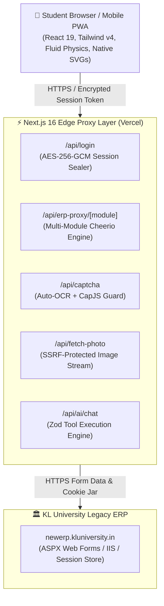

<div align="center">
  
  <h1>⚡ KL Sync</h1>
  <p><strong>An ultra-fast, stateless, Apple-inspired ERP client and edge proxy for KL University students.</strong></p>

  <p>
    <a href="https://klhb.vercel.app"></a>
    <a href="https://nextjs.org/"></a>
    <a href="https://react.dev/"></a>
    <a href="https://www.typescriptlang.org/"></a>
    <a href="DESIGN.md"></a>
    <a href="SECURITY.md"></a>
    <a href="SECURITY.md"></a>
  </p>
</div>

---

## 🌟 Key Highlights & Philosophy

- 🚀 **Zero-DB Edge Proxy**: Stateless serverless architecture. Credentials and sessions are never persisted in any database.
- ⚡ **Zero-Loading Dashboard**: All 9 ERP modules prefetched in parallel on login. Dashboard tabs render instantly with SWR in-memory + sessionStorage caching.
- 🔐 **Military-Grade Session Encryption**: Sessions are sealed server-side using **AES-256-GCM** encryption with Web Crypto API.
- 🍏 **Apple Design, Open Design & UI/UX Pro Max**: WWDC fluid spring physics (damping 1.0 default, damping 0.82 momentum, iOS sheet curve), velocity projection $\text{project}(v, 0.998)$, UIKit rubber-banding $\text{rubberband}(x, \text{dim}, 0.55)$, optical typography, specular elevation, translucent glassmorphism (`blur(24px) saturate(180%)`), and multimodal Web Vibration haptics.
- 🪮 **Ponytail Philosophy (Zero-Bloat)**: Pruned heavyweight dependencies (`lucide-react`, `swr`, `clsx`, `tailwind-merge`) in favor of native standard library primitives and a custom zero-runtime 57-component SVG engine.
- ♿ **WCAG 2.2 AAA Compliance**: Contrast $\ge 7.1:1$, interactive touch targets $\ge 44\text{px}$, custom `:focus-visible` rings, and triple accessibility gate (`prefers-reduced-motion`, `prefers-reduced-transparency`, `prefers-contrast`).
- 🌐 **International Compliance**: GDPR, CCPA/CPRA, HIPAA, PIPEDA/CPPA, LGPD, DPDPA, PIPL, 152-FZ regulatory compliance with Data Export (Art. 20), Cryptographic Erasure (Art. 17), and Consent Management. 9-language i18n engine with RTL support.
- 🤖 **Agentic AI Copilot**: Context-aware natural language assistant with typed Zod tool calling for calculating attendance goals, marks predictions, and schedule queries.
- 🛡️ **Exhaustive Test Verification**: Over **320 automated unit/integration tests (54 suites)**, **13 Playwright E2E tests**, **15 Challenger stress suites**, and **9 Agent-as-Judge AI evaluations**.

---

## 🏛️ System Architecture


```mermaid
graph TD
    Client["📱 Student Browser / Mobile PWA<br/>(React 19, Tailwind v4, Fluid Physics, Native SVGs)"]
    
    subgraph EdgeProxy ["⚡ Next.js 16 Edge Proxy Layer (Vercel)"]
        AuthRoute["/api/login<br/>(AES-256-GCM Session Sealer)"]
        ERPProxy["/api/erp-proxy/[module]<br/>(Multi-Module Cheerio Engine)"]
        CaptchaRoute["/api/captcha<br/>(Auto-OCR + CapJS Guard)"]
        PhotoProxy["/api/fetch-photo<br/>(SSRF-Protected Image Stream)"]
        AIChat["/api/ai/chat<br/>(Zod Tool Execution Engine)"]
    end

    subgraph LegacyERP ["🏛️ KL University Legacy ERP"]
        ERPServer["newerp.kluniversity.in<br/>(ASPX Web Forms / IIS / Session Store)"]
    end

    Client -->|HTTPS / Encrypted Session Token| EdgeProxy
    EdgeProxy -->|HTTPS Form Data & Cookie Jar| LegacyERP
```

---

## 📦 Complete Dashboard Module Suite

KL Sync provides full coverage across all 11 core academic services:

| Module | Route | Icon | Key Features |
|:---|:---|:---:|:---|
| **Overview** | `/dashboard` | 📊 | Hero CGPA banner, real-time stat cards, today's schedule widget, quick navigation pills. |
| **Attendance** | `/dashboard/attendance` | ⏱️ | Overall percentage gauge, circular progress charts, dynamic attendance breakdown graph, class projection simulator. |
| **Timetable** | `/dashboard/timetable` | 📅 | Dual view (Interactive matrix grid & chronological list), day filters (`Mon`-`Sun`), period slot highlighter, CSV export. |
| **Marks & CGPA** | `/dashboard/marks` | 📝 | Internal components, semester end exams, dynamic GPA trend graphs, search filters, course analytics. |
| **Profile** | `/dashboard/profile` | 👤 | Dynamic student ID card, academic demographics, photo streamer, multi-table university records. |
| **Fee Management** | `/dashboard/fee` | 💳 | Total paid vs pending balances, fee breakdown donut charts, receipt download status. |
| **Tools & Calculators** | `/dashboard/tools` | 🧮 | Attendance Target Calculator (synced with real data) + CGPA Goal Feasibility Predictor. |
| **Circulars** | `/dashboard/circulars` | 📢 | Academic notices, exam schedules, and department announcements with empty state handling. |
| **Hostel Allocation** | `/dashboard/hostels` | 🏢 | Room numbers, block allocation details, bed type, and occupancy verification. |
| **Library Portal** | `/dashboard/library` | 📚 | Borrowed book records, accession numbers, issue/due dates, and fine tracking. |
| **Exam Seating** | `/dashboard/exam-seating` | 🧮 | Examination room numbers, desk assignments (`Desk D-14`), session timings (`FN/AN`). |

---

## 🔒 Security Architecture & Zero-Plaintext Policy

- **No Plaintext Secrets in Repositories**: Tokens and keys are **never** committed to version control. `.env.local` is strictly blocked by `.gitignore`.
- **Encrypted Production Secrets**: Production deployments configure `SESSION_SECRET` as a sensitive encrypted variable in the Vercel Dashboard.
- **SSRF Hardening**: Proxy endpoints strictly validate target origins against `https://newerp.kluniversity.in`.
- **Fatal Production Exception**: In production mode (`NODE_ENV=production`), omitting `SESSION_SECRET` immediately throws a `[SECURITY FATAL]` halt to prevent insecure fallback operation.

---

## 🛠️ Environment Variables Configuration

Copy `.env.example` to `.env.local` for local development:

```bash
cp .env.example .env.local
```

| Variable | Environment | Required? | Description |
|:---|:---:|:---:|:---|
| `SESSION_SECRET` | Production & Preview | **Yes** | 32+ character key for AES-256-GCM encryption (`openssl rand -hex 32`). |
| `OPENAI_API_KEY` | All | Optional | OpenAI API key for AI Copilot Assistant functionality. |
| `OCR_SPACE_API_KEY` | All | Optional | Free OCR key from [ocr.space](https://ocr.space/ocrapi) for captcha auto-resolution. |
| `CAP_SECRET` | All | Optional | Proof-of-work challenge token signing secret. |
| `UPSTASH_REDIS_REST_URL` | All | Optional | Upstash Redis REST endpoint for distributed rate-limiting. |
| `UPSTASH_REDIS_REST_TOKEN` | All | Optional | Upstash Redis REST access token. |

---

## 🚀 Quickstart & Local Setup

```bash
# 1. Clone the repository
git clone https://github.com/tejaswin-amara/kl-sync.git
cd kl-sync

# 2. Install dependencies (Clean & minimal footprint)
npm install

# 3. Start local development server
npm run dev

# 4. Access the portal
open http://localhost:3000
```

---

## 🧪 Comprehensive Quality Gates

Every commit and pull request must pass the full verification battery:

```bash
# 1. Strict TypeScript compilation (0 errors)
npx tsc --noEmit

# 2. ESLint code standard analysis (0 errors)
npm run lint

# 3. Comprehensive Unit & Integration Test Suite (320 / 320 Passing across 54 suites)
npm test

# 4. Programmatic Agent-as-Judge AI Suite (9 / 9 Passing)
npx tsx scripts/agent-as-judge.ts

# 5. Playwright End-to-End Suite
npx playwright test

# 6. Production Turbopack Build Verification
npm run build
```

---

## 📜 Documentation Links

- **[ARCHITECTURE.md](ARCHITECTURE.md)**: Deep dive into the edge proxy, Cheerio parsers, and data flow.
- **[DESIGN.md](DESIGN.md)**: Design system tokens, fluid physics equations, color contrast matrix, and WCAG 2.2 AAA specifications.
- **[SECURITY.md](SECURITY.md)**: Responsible disclosure policy, threat model, and cryptographic guarantees.
- **[LICENSE](LICENSE)**: Strict proprietary source-available license (Personal educational use only, zero public re-hosting).
- **[AGENTS.md](AGENTS.md)**: Coding rules and verification sequence for AI agents and contributors.
- **[CHANGELOG.md](CHANGELOG.md)**: Version history, dependency removals, and release notes.

---

## ⚖️ License & Disclaimer

- **License**: Copyright © 2026–present Tejaswin Amara. All rights reserved. This software is provided under a **Strict Proprietary & Source-Available License** for personal educational study and local execution only. Third-party public cloud hosting, commercial distribution, and uncredited mirroring are strictly forbidden. See [LICENSE](LICENSE) for terms.
- **Affiliation**: KL Sync is an independent project created for KL University students. It is **not** affiliated with, endorsed by, or supported by KL University. Student credentials are used strictly for in-flight authentication and are never stored or logged.

<p align="center">
  Crafted with ❤️ by <a href="https://github.com/tejaswin-amara">Tejaswin</a> for KLU students.
</p>
